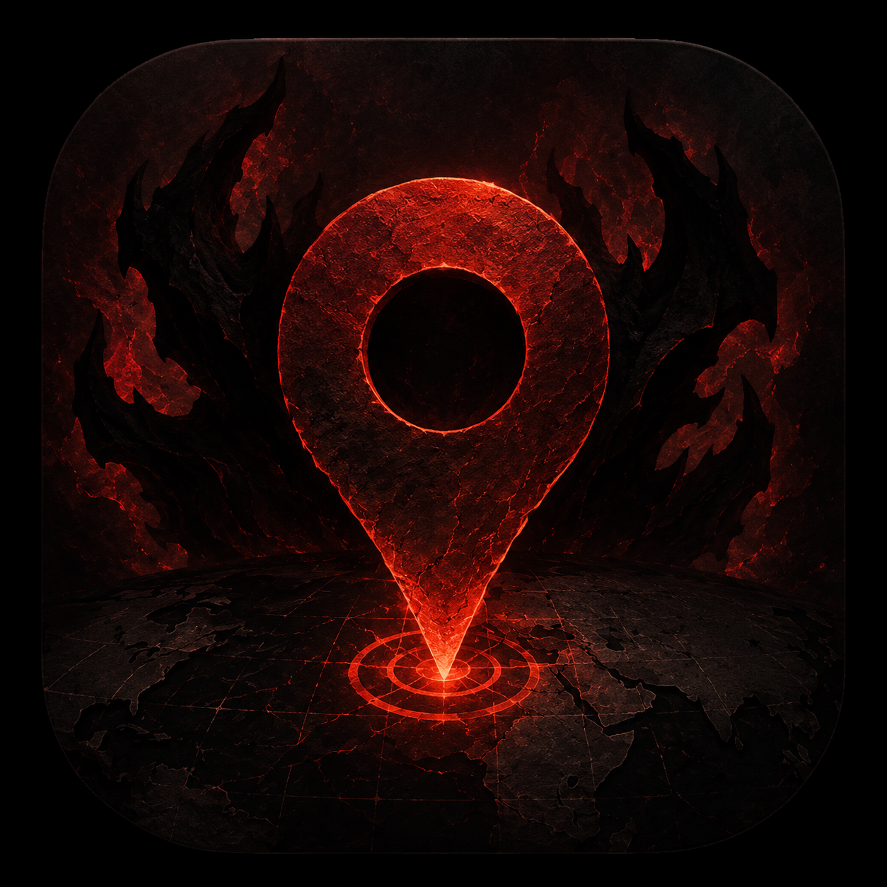
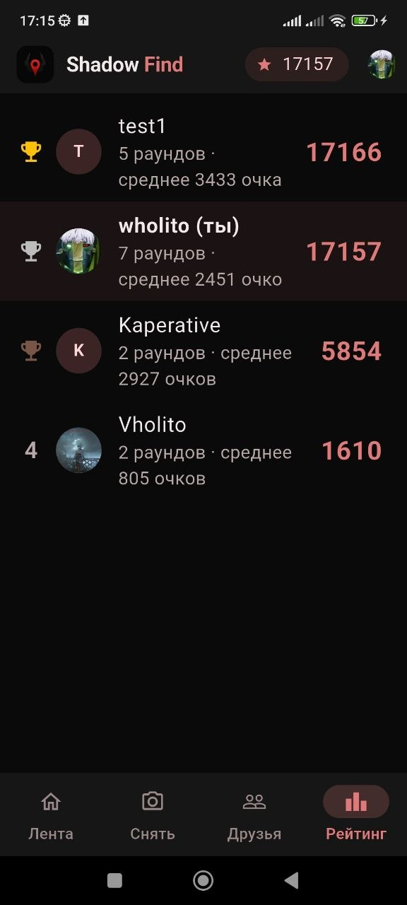
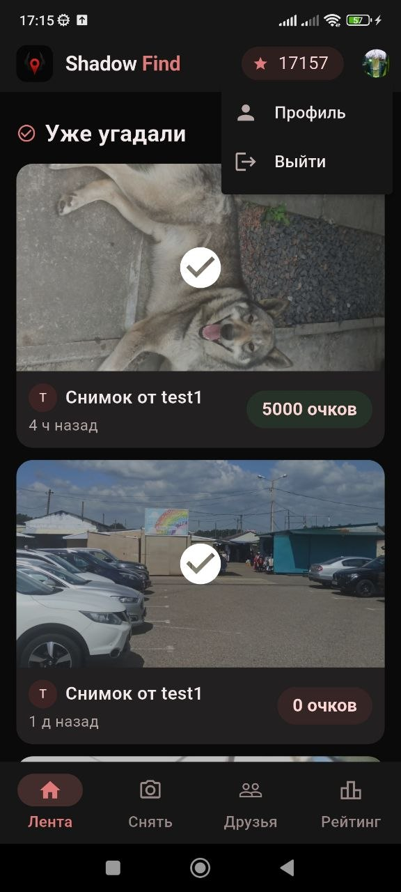
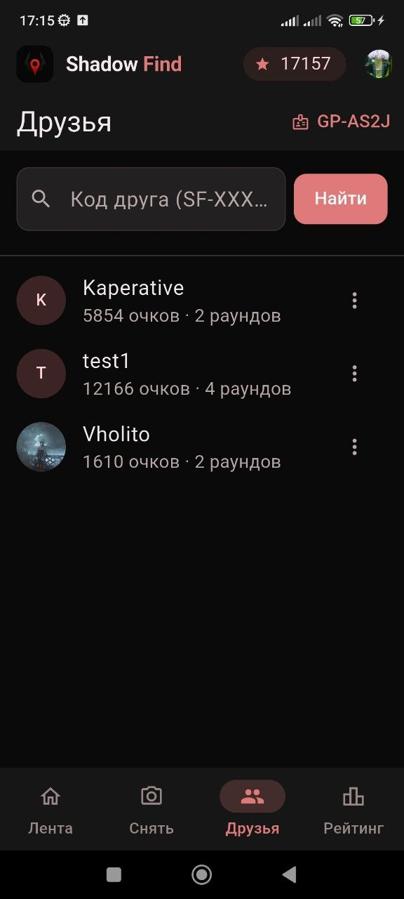

# Shadow Find

  

Мобильная geo-игра: сними место, отправь друзьям, угадай на карте. Firebase, Cloudinary, OpenStreetMap.

## Стек

- Flutter, Provider
- Firebase Auth, Firestore, FCM, Cloud Functions
- Cloudinary, flutter_map, camera, geolocator

## Запуск

1. `flutter pub get`
2. Настройте `lib/firebase_options.dart` и `android/app/google-services.json`
3. `dart run flutter_launcher_icons`
4. `flutter run`

## Возможности

- Съёмка фото с GPS и отправка друзьям
- Угадывание на карте OSM
- Очки по расстоянию, рейтинг
- Приглашения в друзья и push-уведомления
- Desktop/web: режим только угадывания
## Скриншоты

